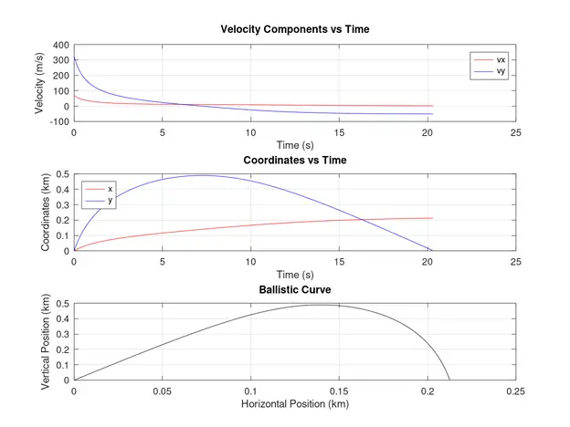
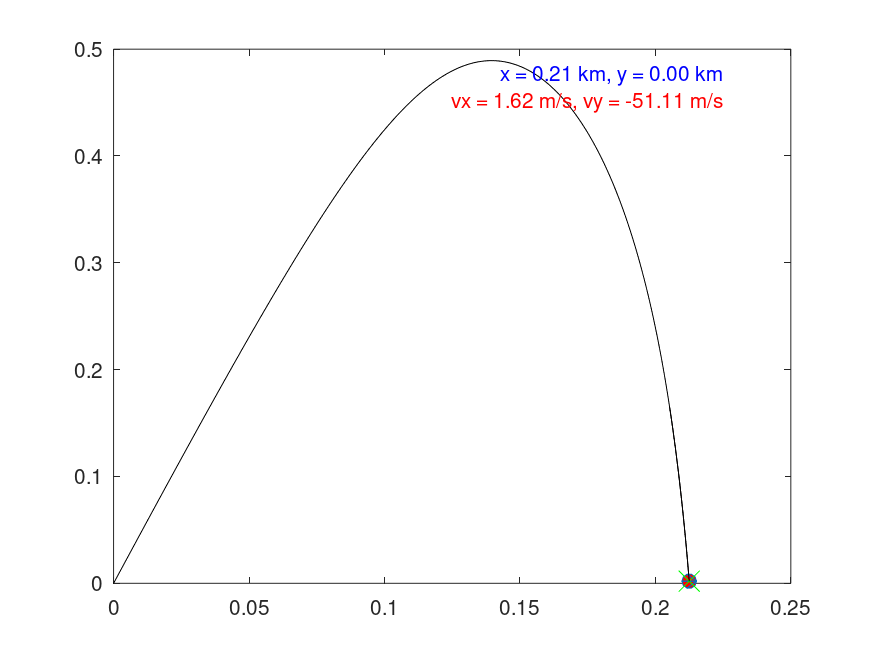

# Projectile Trajectory

## Overview

The Projectile Trajectory is a `MATLAB/Octave` script designed to simulate the **trajectory of a projectile** launched into the air under the influence of *gravity* and *air resistance*. It is a computational model that provides insights into the motion of a projectile, computing various quantities and visualizing the trajectory for analysis and understanding.

 

## Intended Use Cases

- **Educational Purposes:** Serves as an invaluable resource for students to understand and visualize the principles of projectile motion in detailed physics education.
- **Engineering Applications**: Offers insights and practical utility for engineers working on complex projects in areas such as ballistics and aerospace engineering.

## Key Features

**Visualization:**

- `Plotting`: Generates detailed plots of velocity components, trajectory, and motion laws to vividly visualize the projectile's motion over time for enhanced understanding.
- `Animation`: Crafts an engaging animated visualization of the trajectory, offering a comprehensive and dynamic representation of the projectile's path through space.

**Output and Analysis:**

- `Log Files`: Logs the computed quantities and results for detailed further analysis, debugging, performance evaluation, and convenient future reference.
- `Output Directory`: Methodically organizes the generated plots and detailed log files in a structured output directory for streamlined access and effective management.

**Relevant Metrics:**

- `Flight Time`: Computes the total time the projectile spends in the air.
- `Range`: Calculates the horizontal distance traveled by the projectile.
- `Maximum Altitude`: Determines the highest point reached by the projectile.
- `Ascent and Descent Times`: Identifies the time taken for the projectile to ascend and descend.
- `Heat Produced`: Estimates the heat generated during the motion of the projectile.

```r
   ============= PROJECTILE MOTION =============
            Flight Time: 4.587242 s
            Range: 0.426711 km
            Maximum Altitude: 0.027452 km
            Ascent Time: 1.995086 s
            Descent Time: 2.592156 s
            Heat Produced: 21.942012 kJ
   =============================================
   ============= PROJECTILE MOTION =============
            Flight Time: 16.925352 s
            Range: 0.652901 km
            Maximum Altitude: 0.371898 km
            Ascent Time: 5.946745 s
            Descent Time: 10.978606 s
            Heat Produced: 86.794148 kJ
   =============================================
   .......
```

## Additional Information

- **Animation:** The animation provides a dynamic and visually engaging representation of the projectile's trajectory, allowing users to observe its movement in real-time with accuracy and clarity.
- **Result Files:** Alongside the `log.txt` file, the script generates `png images` depicting the **trajectory**, **velocity**, and position **curve** as functions of time, providing visual aids for analysis and presentation.

## Usage

1. **Run Script:** Execute the `test_projectile.sh` script in your terminal.
**Options:**
   - `1` to **run** the projectile simulation.
   - `2` to **clean** up the log file.
   - `3` to **exit** the program.
2. **Call Function:** To simulate the trajectory of a projectile programmatically, use the:

   - `projectile_trajectory(v0, alpha0)` function, where:
     - `v0` is the **initial velocity** (*in m/s*)
     - `alpha0` is the **launch angle** (*in degrees*).
